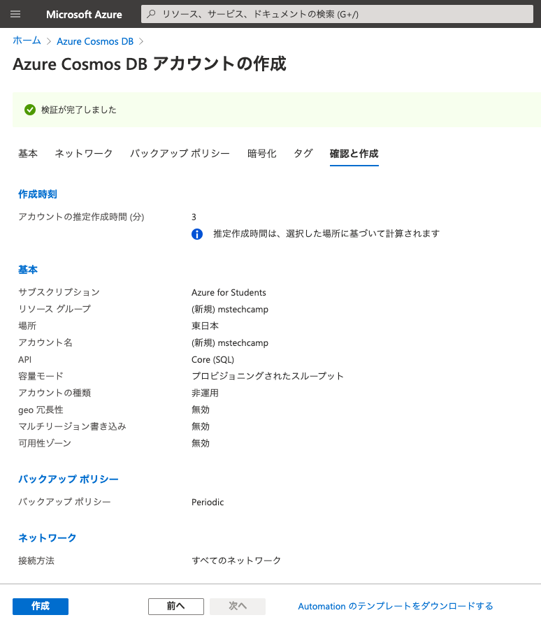
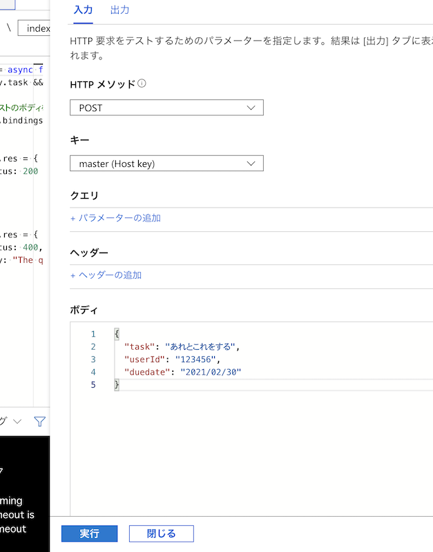
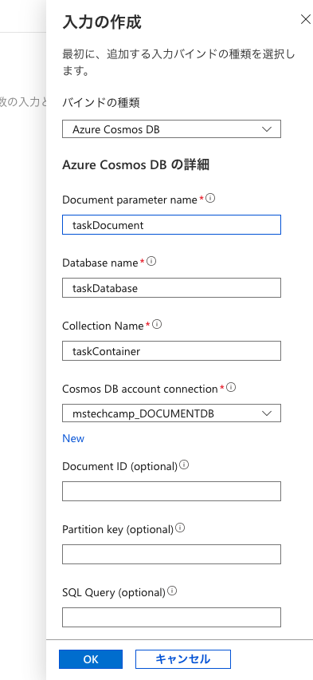
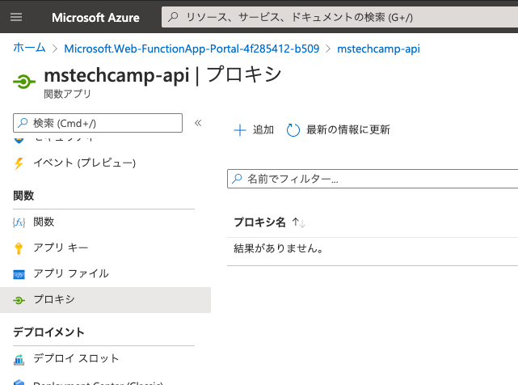

# MS Tech camp #4 \~Azure Functions と Cosmos DB でサーバレス Web API を作ろう！\~

[MS Tech Camp #4](https://mspjp.connpass.com/event/203902) のハンズオン資料です。

このハンズオンでは、タスク管理のための Web API を Azure Functions と Azure Cosmos DB を使って作ります。
具体的には、以下のエンドポイントを提供する Web API を開発します。
- `GET /tasks` ： タスクの一覧を取得
- `GET /tasks/{id}` ： 指定した `id` を持つタスクを取得
- `POST /tasks` ： リクエストボディで指定したタスクを追加

タスクの例を次に示します。
```js
{
    "task": "あれとこれをする", // タスクの内容
    "userId": "123456",      // タスク作成者のユーザID
    "duedate": "2021/02/30"  // タスクの期日
}
```

## 目次
1. Azure Cosmos DB アカウントを作成
2. Azure Cosmos DB コンテナーを作成
3. Azure Functions アプリを作成
4. Azure Functions の関数を作成
5. Azure Functions のプロキシ機能を設定
6. 動作確認
7. リソースを削除

## 1. Azure Cosmos DB アカウントを作成
まず、Azure Cosmos DB のアカウントを作成するところから始めましょう。

1. Azure portal から **リソースの作成** を選択します。

2. **新規** ページで「Azure Cosmos DB」を検索して選択します。

||
|:-:|

3. **作成** を選択します。

||
|:-:|

4. 以下の設定値を入力して、**確認と作成** を選択します。

| 項目 | 設定値 | 例 |
|-----|-------|----|
| サブスクリプション | 任意 | Azure for Students |
| リソースグループ | 新規作成で任意 | mstechcamp |
| アカウント名 | 任意（一意の名前） | mstechcamp |
| API | コア（SQL） | |
| Notebooks | オフ | |
| 場所 | 任意 | （Asia Pacific）東日本 |
| 容量モード | プロビジョニングされたスループット | |
| Free レベルの割引の適用 | 適用 | |


※ アカウント名は世界中で一意な名前である必要があります。

※ API で設定した コア（SQL）では、SQL 構文を使用して Cosmos DB のデータベースを操作することができます。
2021年2月現在、Azure Functions と Cosmos DB を簡単に連携（バインド）するには、この SQL API を使用する必要があります。

※ **次のスクリーンショットでは Free レベルの割引の適用が無効になっていますが、無料の Cosmos DB アカウントが既に存在していなければ有効になっているはずで、無料で利用できるはずです。**

||
|:-:|

5. アカウントの設定を確認し、**作成** を選択します。
   
||
|:-:|

6. **デプロイが完了しました** と表示されるまで数分待ちます。
   表示されたら **リソースに移動** を選択します。
   これで Cosmos DB アカウントの作成は完了です！

||
|:-:|


## 2. Azure Cosmos DB コンテナーを作成
続いて、Cosmos DB のアカウントにデータを格納するための **コンテナー** を作成していきます。
Azure Functions を設定するときに自動的に作成することも可能ですが、今回のハンズオンでは手作業でやりたいと思います。

1. Azure Cosmos DB アカウントの **概要** ページに移動して、上部のメニューバーにある **コンテナーの追加** を選択します。

||
|:-:|

2. **New Container** を選択して、以下の設定値を入力します。
   入力が終わったら **OK** を選択します。
   これでコンテナーの作成は完了です！

| 項目 | 設定値 |
|-----|-------|
| Database id | taskDatabase |
| Provision database throughput | チェックを入れる |
| Throughput | Manual（400） |
| Container id | taskContainer |
| Partition key | /userId |

※ Cosmos DB の無料枠では、5GB のストレージ容量と最大 400RU/s のスループットが提供されます。

※ RU（Request Unit）はデータベースの操作にかかるコストで、1RU は 1KB のアイテムを読み取るコストに相当します。

※ 実際のアプリケーション開発の際にスループットやパーティーションキーをどのように設定するべきかは、Microsoft Learn の [スケーリングするようにビルドされた Azure Cosmos DB データベースを作成する](https://docs.microsoft.com/ja-jp/learn/modules/create-cosmos-db-for-scale/) で解説されています。

||
|:-:|

3. 作成したコンテナーの現状を確認するには、**データエクスプローラー** ページで **taskDatabase** → **taskContainer** → **Items** と選択します。
   現在はまだデータは格納されていません。

||
|:-:|


## 3. Azure Functions の関数アプリを作成
ここからは Azure Functions を設定していきます。
まず、Function App（関数アプリ）を作成しましょう。

1. Azure portal から **リソースの作成** を選択します。

2. **新規** ページで「Function App」を検索して選択します。

||
|:-:|


3. **作成** を選択します。

||
|:-:|

4. 以下の設定値を入力して、**確認および作成** を選択します。

| 項目 | 設定値 | 例 |
|-----|-------|----|
| サブスクリプション | Cosmos DB と同じ | Azure for Students |
| リソースグループ | Cosmos DB と同じ | mstechcamp |
| 関数アプリ名 | 任意（一意の名前） | mstechcamp-api |
| 公開 | コード | |
| ランタイムスタック | Node.js | |
| バージョン | 14 LTS | |
| 地域 | Cosmos DB と同じ | Japan East |

※ 関数アプリ名は世界中で一意な名前である必要があります。

※ 関数アプリ名に `azurewebsites.net` を加えた名前が Web API の URL になります。

※ 今回は JavaScript を使って実装することにします。

||
|:-:|

5. 関数アプリの設定を確認し、**作成** を選択します。

||
|:-:|

6. **デプロイが完了しました** と表示されるまで数分待ちます。
   表示されたら **リソースに移動** を選択します。
   これで関数アプリの作成は完了です！

||
|:-:|


## 4. Azure Functions の関数を作成
続いて、関数アプリに **関数** を追加します。

今回は2つの関数を作ります。
- データベースにタスクを追加するための Create 関数
- データベースからタスクを読み取るための Read 関数

これから作る Web API は合計3つのエンドポイントを公開しますが、作成する関数は上記の2つのみです。
これは Read 関数1つで `GET /tasks` と `GET /tasks/{id}` の2つのエンドポイントを実装することにするためです。


### 4.1 Create 関数を追加
まずは、Create 関数から作ります。

1. 関数アプリの **関数** ページに移動して、上部のメニューバーにある **追加** を選択します。
   **関数の追加** ウィンドウが表示されます。

||
|:-:|

2. 以下の設定値を入力して、**追加** を選択します。

| 項目 | 設定値 |
|-----|-------|
| 開発環境 | ポータルでの開発 |
| テンプレート | HTTP trigger |
| 新しい関数 | Create |
| Authorization level | Anonymous |

※ Visual Studio Code などを使ってローカルで開発することも可能ですが、今回はポータル上で開発していきます。

※ HTTP trigger は HTTP リクエストをトリガーとして関数を実行します。

※ Anonymous は関数を実行するための HTTP リクエストに特殊なパラメータが要らない承認レベルです。
今回は簡単のために Anonymous を使用します。

||
|:-:|

3. Create 関数のページに移動したら、**統合** を選択し、**HTTP (req)** を選択します。
   **トリガーの編集** ウィンドウが表示されます。

||
|:-:|

4. **Selected HTTP methods** の **GET** のチェックを外し、保存を選択します。

||
|:-:|


5. **出力の追加** を選択します。
   **出力の作成** ウィンドウで、以下の設定値を入力して、**OK** を選択します。

| 項目 | 設定値 |
|-----|-------|
| バインドの種類 | Azure Cosmos DB |
| Document parameter name | taskDocument |
| Database name | taskDatabase |
| Collection Name | taskContainer |
| If true, creates the Cosmos DB databas... | いいえ |
| Cosmos DB account connection | （新規作成） |

Cosmos DB account connection を新規作成する手順は次の通りです。
1. **New** を選択します。
2. **Azure Cosmos DB アカウント** を選択し、前の手順で作成したデータベースアカウント（例えば mstechcamp）を選択してから、**OK** を選択します。

※ 関数のコード内では、ドキュメントパラメータ名で指定した名前（ここでは taskDocument）で Cosmos DB オブジェクトを参照できます。

||
|:-:|

6. **コードとテスト** ページに移動し、既存の関数のコードを、次のコードに書き換えます。
   その後、**保存** を選択します。

```js
module.exports = async function (context, req) {
    if (req.body.task && req.body.userId) {

        // リクエストのボディをデータベースにそのまま格納
        context.bindings.taskDocument = req.body;

        // 成功
        context.res = {
            status: 200
        };
    }
    else {
        // 失敗
        context.res = {
            status: 400,
            body: "The query options 'task' and 'userId' are required."
        };
    }
}
```

taskDocument に代入された HTTP リクエストのボディは、Azure Functions のバインディング機能によって、Cosmos DB のデータベースに格納されます。

ボディにパラメータ `task` と `userId` がない場合は、エラーとします。

以上で Create 関数の追加は完了です！

## 4.2 Create 関数をテスト
もう一つの関数を追加する前に、Create 関数の動作を確認してみましょう。

1. **テストと実行** を選択し、**入力** タブの **ボディ** のコードを次のコードで置き換えます。

```js
{
    "task": "あれとこれをする",
    "userId": "123456",
    "duedate": "2021/02/30"
}
```

2. **実行** を選択します。

||
|:-:|


実行結果の **出力** タブで、**HTTP 応答コード** が `200 OK` になっていれば OK です！

Read 関数を追加して、本当にデータが追加されたかどうかを確認してみましょう。

### 4.3 Read 関数を追加
これまでと同様の手順で Read 関数を追加していきます。
Create 関数と異なるのは、出力バインディングではなく入力バインディングに Cosmos DB を設定するところです。

1. 関数アプリの **関数** ページに移動して、上部のメニューバーにある **追加** を選択します。
   **関数の追加** ウィンドウで、以下の設定値を入力し、**追加** を選択します。

| 項目 | 設定値 |
|-----|-------|
| 開発環境 | ポータルでの開発 |
| テンプレート | HTTP trigger |
| 新しい関数 | Read |
| Authorization level | Anonymous |

||
|:-:|

2. **統合** ページに移動して、**HTTP (req)** を選択します。
   **トリガーの編集** ウィンドウで、**Selected HTTP methods** の **POST** のチェックを外し、保存を選択します。

||
|:-:|


3. **入力の追加** を選択します。
   **入力の作成** ウィンドウで、以下の設定値を入力して、**OK** を選択します。

| 項目 | 設定値 |
|-----|-------|
| バインドの種類 | Azure Cosmos DB |
| Document parameter name | taskDocument |
| Database name | taskDatabase |
| Collection Name | taskContainer |
| Cosmos DB account connection | （Create 関数と同じ） |

||
|:-:|

4. **コードとテスト** ページに移動し、既存の関数のコードを、次のコードに書き換えます。
   その後、**保存** を選択します。

```js
module.exports = async function (context, req) {
    if (req.query.id) {
        // 指定した id を持つタスクを取得
        const task = context.bindings.taskDocument
                        .find(e => e.id === req.query.id);

        if (task) {
            // 成功
            context.res = {
                status: 200,
                body: {
                    id: task.id,
                    task: task.task,
                    userId: task.userId,
                    duedate: task.duedate
                }
            };
        } else {
            // 失敗
            context.res = {
                status: 404,
                body: "Not found."
            };
        }

    } else {
        // タスクの一覧を取得
        context.res = {
            status: 200,
            body: context.bindings.taskDocument.map(e => {
                return {
                    id: e.id,
                    task: e.task,
                    userId: e.userId,
                    duedate: e.duedate
                };
            })
        };
    }
}
```

このコードでは、レスポンスに含める項目を取捨選択しています。
これにより Cosmos DB のシステム内で使われるプロパティを返さないようにしています。

以上で Read 関数の追加は完了です！

## 4.4 Read 関数をテスト
まずは、一覧取得をテストしましょう。

1. **テストと実行** を選択し、**入力** タブの **HTTP メソッド** を `GET` に設定します。
   **ボディ** は必要ありませんが、今回の実装では無視されるため、そのままでも問題ありません。

2. **実行** を選択します。

||
|:-:|

3. 実行結果の **出力** タブで、**HTTP 応答のコンテンツ** に Create 関数のテストで入力したタスクが表示されていることを確認します。

||
|:-:|

表示されている `id` の値（例えば `53a369ec-3171-41c7-b4c4-8a1e42c5a402`）をメモしておきます。

この `id` を使って、id を指定する場合のテストをしましょう。

1. **テストと実行** を選択し、**入力** タブの **HTTP メソッド** を `GET` に設定します。
   そして、**クエリ** を以下のように設定します。 
   今回も **ボディ** は必要ありません。

| 名前 | 値 |
|-----|-------|
| id | （メモした id の値） |

||
|:-:|

2. **実行** を選択します。

3. **出力** タブの **HTTP 応答のコンテンツ** に指定した `id` と一致するタスクが表示されていることを確認します。

||
|:-:|

4. もしデータベースに存在しない `id` を **クエリ** の **値** に入力した場合は、`Not found.` と表示されるはずです。

以上で2つの関数の追加とテストは完了です！

## 5. Azure Functions のプロキシ機能を設定
ここまでの作業で、Web API は最低限動作するようになりました。

例えば、Read 関数を `https://mstechcamp-api.azurewebsites.net/api/Read` のように呼び出すことができます。
この各関数の URL は **コードとテストページ** の上部のメニューバーにある **関数の URL の取得** を選択することで取得できます。

しかし、id を指定するには `/api/Read?id=abc123` のようにクエリパラメータとして指定しなければなりません。
本資料の一番最初で説明したように、今回は `/tasks/{id}` という形式にしたいです。

また、`https://mstechcamp-api.azurewebsites.net/tasks` という1つの URL に対して、HTTP メソッドが GET の場合は Read 関数を呼び出し、POST の場合は Create 関数を呼び出したいです。

Azure Functions のプロキシ機能を設定することで、これらを実現できます。
設定手順は以下の通りです。

1. 関数アプリの **プロキシ** ページに移動します。

||
|:-:|

2. **追加** を選択します。
   以下の設定値を入力して、**作成** を選択します。
   これをエンドポイントごとに実施します。

#### `GET /tasks`

| 項目 | 設定値 |
|-----|-------|
| 名前 | task-read |
| ルートテンプレート | /tasks |
| 許可されている HTTP メソッド | 選択したメソッド（GET） |
| バックエンド URL | （Read 関数の URL） |

||
|:-:|

#### `GET /tasks/{id}`

| 項目 | 設定値 |
|-----|-------|
| 名前 | task-read-id |
| ルートテンプレート | /tasks/{id} |
| 許可されている HTTP メソッド | 選択したメソッド（GET） |
| バックエンド URL | （Read 関数の URL） |
| [要求のオーバーライド] クエリ | id と {id} |

||
|:-:|

#### `POST /tasks`

| 項目 | 設定値 |
|-----|-------|
| 名前 | task-create |
| ルートテンプレート | /tasks |
| 許可されている HTTP メソッド | 選択したメソッド（POST） |
| バックエンド URL | （Create 関数の URL） |

||
|:-:|

3. 合計で3つのプロキシが作成されていることを確認します。

||
|:-:|

プロキシの設定は以上です。
これで Web API が完成しました！

## 6. 動作確認
お好みのツール（例えば [API Tester](https://apitester.com/)）を使用して、作成した Web API の動作を確認してみましょう。

次の画像では、ブラウザを使って、タスク一覧取得 API の動作を確認しています。

||
|:-:|

## 7. リソースを削除
最後に、作成したリソースを削除する方法を紹介します。

1. Azure portal から **リソースグループ** を選択し、作成したリソースグループ名（例えば `mstechcamp`）を選択します。

||
|:-:|

2. **リソースグループの削除** を選択し、確認のためリソースグループ名（例えば `mstechcamp`）をテキストボックスに入力して、**削除** を選択します。

||
|:-:|

お疲れ様でした！

## おわりに
ハンズオンはこれで終わりですが、今回のハンズオンの応用例や補足事項を紹介します。

Azure Static Web Apps を使うと、今回作成した Web API を利用する Web サイトを簡単＆無料で公開することができます。
素晴らしいハンズオン資料が [こちら](https://github.com/himanago/azure-serverless-webapp-hands-on) から利用できます。

Cosmos DB を無料枠内で運用していくには、いくつか気をつけるべきポイントがあります。
わかりやすいまとめが [Azure Cosmos DB の無償枠 (Free Tier) の注意点](https://qiita.com/ymasaoka/items/ffc3a44eef75bda5a502) にあります。

## アンケート
アンケートにご協力ください！

https://forms.gle/kM2hVH9YSHMFcpsw7

## 参考
- [Azure Cosmos DB と Functions を使用して非構造化データを格納する](https://docs.microsoft.com/ja-jp/azure/azure-functions/functions-integrate-store-unstructured-data-cosmosdb?tabs=javascript)
- [himanago/azure-serverless-webapp-hands-on](https://github.com/himanago/azure-serverless-webapp-hands-on)